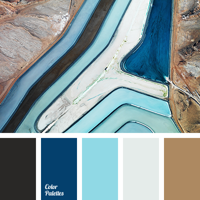
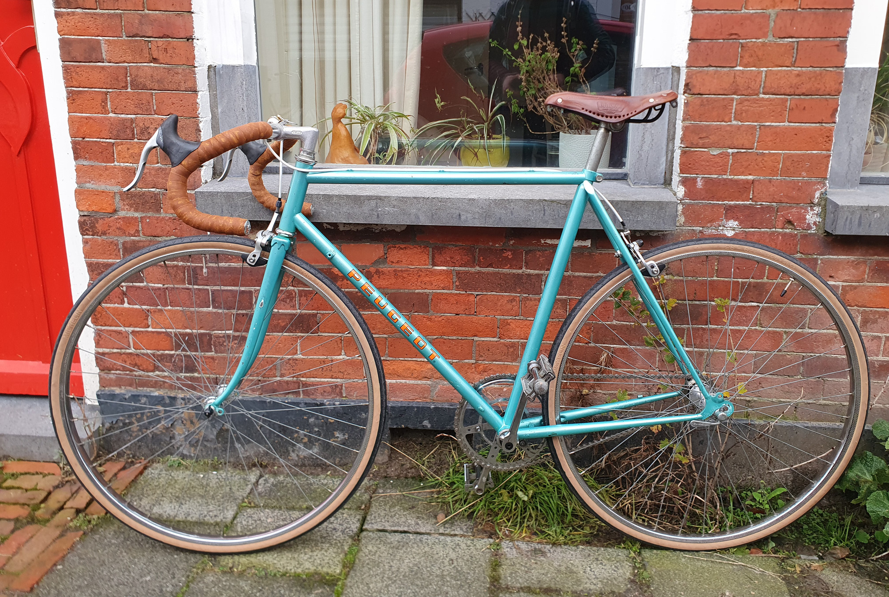

So here I am in my early thirties, buying one of those vintage Peugeot bikes you see all those hipsters riding around on. Am I old enough now to want to feel young again? Am I trying to be cool now after missing out in my twenties?

<!-- <figure style="width: 250px" class="align-right"> -->
<!--    -->
<!--   <figcaption>Photo credit: <a href="https://colorpalettes.net/color-palette-2638/"><b>colorpalettes.net</b></a></figcaption> -->
<!-- </figure> -->
In any case I made a good deal for this fixie, given the state of the frame and the nice saddle, ladies' model or not. I found the bike on Marktplaats, <em>the</em> Dutch website for private sales. I immediatley liked the colour scheme of the light blue frame, combined with the brown saddle and handlebar tape and shiny chrome parts. Just add a bit of white and you got yourself a classic colour palette.

The bike was in no way immediately good to ride. The seat post was barely ending below the clamp, questionable in terms of bike geometry and safety. The crank was missing a screw, the bottom bracket had a bit of play, the chain looked like it had never been lubed. The tire walls were completely frayed, the threads torn and the rubber crumbling. Then there were optical issues such as the unsightly handlebar tape and a bottle opener in place of the removed back brake. This idea I liked to be honest, it was charming, but not very practical.

On the plus side the frame had few scratches or damage to the paint job, the logo at the front and the writing on the side were still both in a good state. The removable parts weren't exactly pretty, but they fit the picture and after some cleaning they should have been nice again.

So much for the first assessment.


 <!-- caption="Full" -->
 <!-- caption="Front with logo" -->
 <!-- caption="Writing and crank" -->
 <!-- caption="Nice little detail" -->

<!--  -->

I started out with some cleaning. Take off the handlebar tape and clean off bits of old adhesive. Take out the seat post and seat, clean out dead spiders and brush of some rust, remove a frayed shoe lace that's being used to keep these Brooks saddles in shape. Remove the old tires and tubes, showering the floor with crumbs of old rubber. Rub the slightly corored spokes and polish the rims, brush out the rim bed.

This forced me to take a close look at a bike and made me notice all kind of issues that had previously gone unnoticed. I definitely learnt a lot about what to look out for when buying a bike again. The biggest problems really were some rather floppy spokes and a slight eight in the back wheel. I never adjusted the spoke tension on any of my bikes, let alone ensuring it's still running true in the process. The back wheel's deformation wasn't so bad, so I left that to fix for a later time.

I never cycled on a fixie before and at this time of the year (autumn) and my life (generally busy and not a lot of energy to invest into such a drastic change of lifestyle), I decided to at least turn it into a single speed with a free-wheel. That meant installing brakes in the front and back. Some day I might want multiple gears, but for now I wanted to embrace of a one-fits-all gear.

Over the course of some three or four chaotic trips to the local vintage bicycle shop and through a bit of online shopping I got together all the parts I thought I required.

<!--  -->
<!--  -->
<!--  -->
<!--  -->

